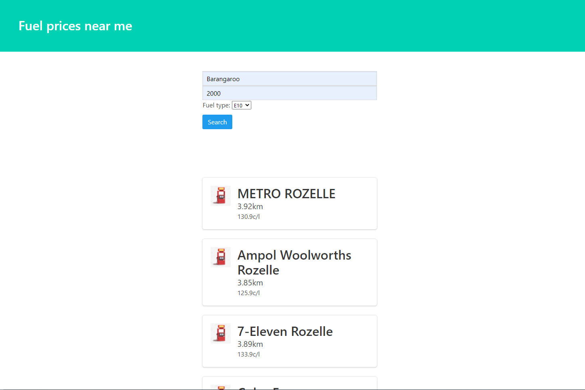

# Python Django Project: I NEED FUEL
# Finding nearest fuel stations

Displays the gas stations with optimal price and distance from the suburb that is being searched which sells the fuel type that has been requested

## Description

I subconsciously compare fuel prices of different gas station brands as well as how they change over time to find an opportunity to fill up at a good price. That being said, I wanted to create this app to quickly show me details of gas stations in a quick and easy to understand manner. Factors contributing to the output is the distance and the gas price. With the input parameters of suburb name, postcode and fuel type, a list of results is quickly generated. 

### Executing program

To run the program, run 'python3 manage.py runserver' in fuel_prices directory.

### Main Components
 - NSW government fuel_prices API: I applied a publicly available government API to retrieve live information regarding gas stations
 - SQL database: Since the API takes latitude and longitude as parameters for location input, it wouldn't be practical to ask for the user 
   to provide this information. To resolve this issue, I outsourced an SQL database which contains Australia suburb names and their corresponding postcodes, latitude and longitude. Hence all I require frrom the user is general information (suburb, postcode). 
   User  -> NSW postcode db -> Fuel API -> result
   
### Example application

